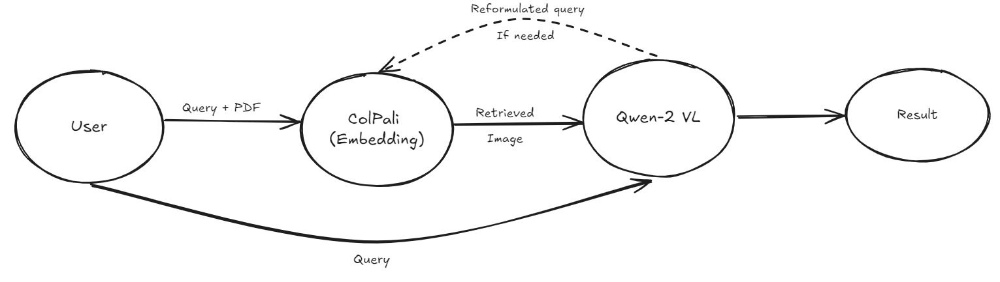
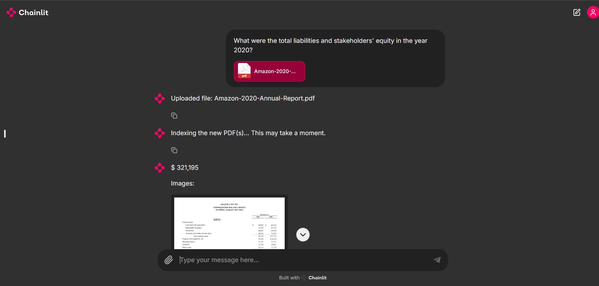
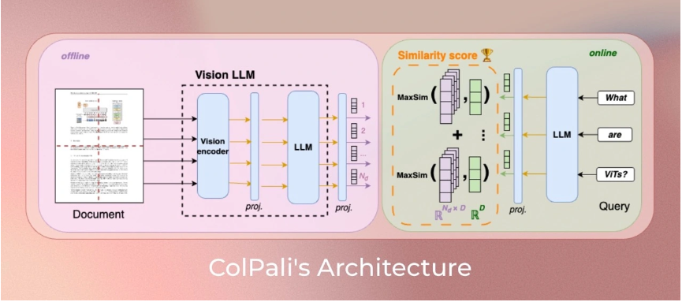

# 🧠 ColPali-Powered RAG: Unlocking Knowledge from PDFs with Advanced AI Models

## 🚀 Overview

Welcome to **ColPali-Powered RAG**, an intelligent Retrieval-Augmented Generation (RAG) solution leveraging cutting-edge AI models like ColPali and Qwen2VL. This project is designed to extract, index, and retrieve information from PDFs, combining the power of natural language processing and image processing. It's like having your own AI librarian—helping you quickly find key information from a stack of documents! 📚🤖

> **✨ Why This Project?**  
> If you are anything like and were working on PDF files for GenAI applications. You know how tedious and difficult it is to do OCR on PDF files especially while mantaining the structure of the text (at least for the unpaid solutions). Sifting through PDFs for valuable information can be tedious. ColPali RAG simplifies this by transforming how you interact with documents. This project highlights an innovative approach to bridging the gap between AI-powered retrieval and content understanding.

## 🌟 Features

- **AI-Powered PDF Indexing:** Seamlessly converts PDFs into searchable embeddings using ColPali's AI model.
- **Intelligent Retrieval:** Asks questions and receives image-based and textual responses using Qwen2VL's advanced capabilities.
- **Scalable:** Handles large batches of documents while efficiently managing GPU resources.
- **Memory-Efficient:** Utilizes GPU memory clearing techniques to ensure smooth processing for complex queries.

 <!-- Add a screenshot or GIF showing a demo of your application here -->

## 🛠️ Tech Stack

- **Python:** Core programming language.
- **Torch:** For model loading and inference.
- **LangChain:** Powers conversation memory for chat interactions.
- **Chainlit:** Enhances interactivity for model responses.
- **PDF2Image:** Converts PDFs into images for easy indexing.
- **Transformers:** Implements advanced NLP and computer vision models.

## 📋 How It Works

1. **PDF Upload:** Upload PDF files through the interface.
2. **Indexing:** The ColPali model processes each page to generate searchable embeddings.
3. **Query:** Ask any question related to the indexed PDFs.
4. **Retrieval:** The model retrieves the most relevant pages, processing them to provide both textual and image-based responses.
5. **AI Chat:** Interact with the AI, getting more context-aware responses through the Qwen2VL model.

 <!-- Add a diagram illustrating the workflow of the project -->

## 🧰 Installation

Follow these steps to set up the environment and run the project:

1. **Clone the repository:**
   ```bash
   git clone https://github.com/yourusername/colpali-rag.git
   cd colpali-rag
   ```
2. **Create a virtual environment:**
   ```bash
   python -m venv env
   source env/bin/activate  # On Windows, use `env\Scripts\activate`
   ```
3. **Install dependencies:**
   ```bash
   pip install -r requirements.txt
   ```
4. **Run the application:**
   ```bash
   python app.py
   ```

## 🕹️ Usage

1. **Start the Application:** Run the application using `python app.py`.
2. **Upload PDFs:** Upload one or multiple PDFs through the UI.
3. **Ask Questions:** Type in any question related to the content of the PDFs.
4. **View Responses:** The application provides image and text responses directly from the indexed documents.

<!-- Add a short video or series of screenshots demonstrating usage -->

## 🤖 Model Details

- **ColPali Model:** Utilizes ColPali's state-of-the-art vision and language capabilities for processing PDF content.
- **Qwen2VL:** Adds an extra layer of intelligence to interpret user queries and retrieve the most relevant information.

>ColPali is a visual retrieval model based on Vision Language Models (VLMs) that efficiently indexes documents through their visual features. It extends the PaliGemma-3B model to generate multi-vector representations for text and images. This model uses image patch embeddings processed through a language model, mapping them to a latent space similar to textual input. By applying the ColBERT strategy, it enhances interaction between text tokens and image patches, improving performance.



## 🧩 Customization

- **Model Fine-Tuning:** You can swap the base models with any compatible `transformers` model by modifying the `model_name` parameters in `colpali_rag.py`.
- **Storage Backends:** Adapt the code to store indexed embeddings in a database for larger-scale applications.

## 🛡️ Handling Errors

The code includes error handling for PDF processing and GPU memory management. For further troubleshooting, check out the comments in `colpali_rag.py` and `app.py`.


## 🔥 Future Enhancements

- **Web Interface:** Build a full-fledged web interface for a more user-friendly experience.
- **Distributed Processing:** Enable multi-GPU support for handling extremely large datasets.


## 📷 Share Your Use Case!

Got an exciting use case or integration with this project? Share it on LinkedIn and tag us! We love to see how this project is making a difference. 💡📈

---

> Created with ❤️ by Yash Bhardwaj.  
> Feel free to connect with me on [LinkedIn](https://www.linkedin.com/in/yashbhardwaj19/) for more insights into AI.

---

This README aims to make the project sound intriguing and useful, offering enough information to entice users to try it out while keeping the technical aspects accessible. You can replace the placeholders with your images and links to enhance engagement on LinkedIn!